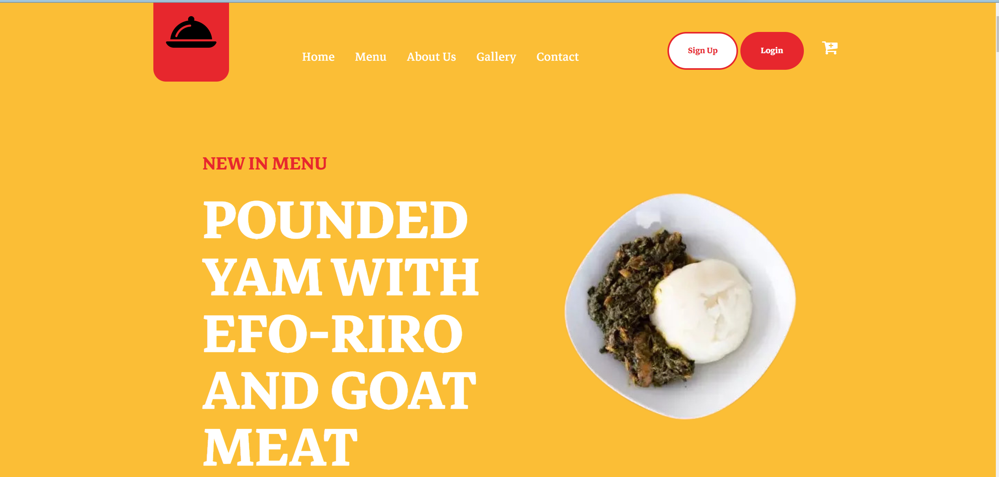
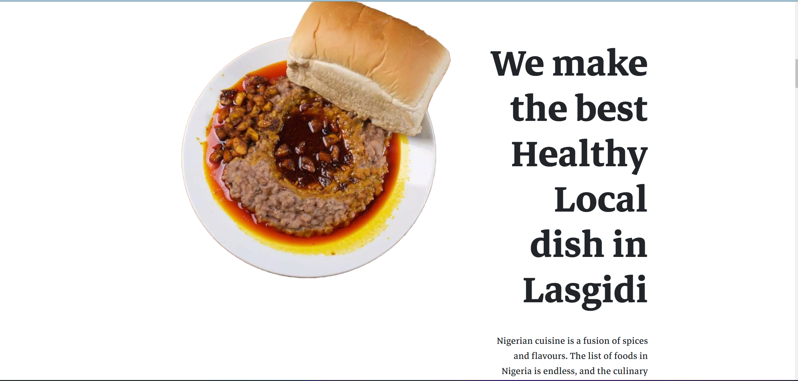
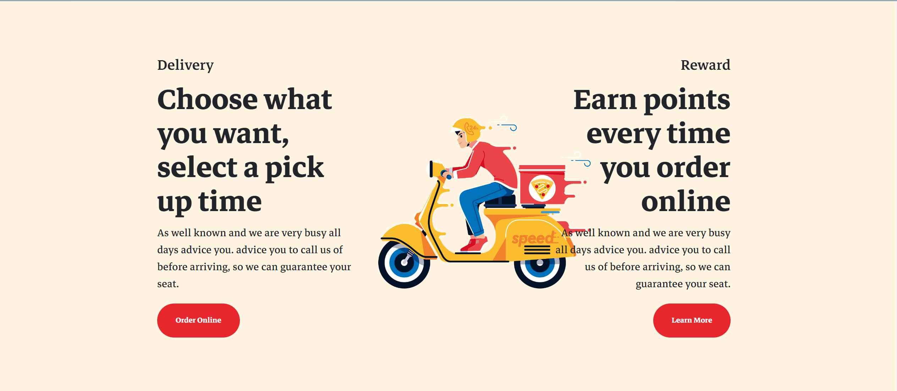

# Menjar
> Menjar is a seamless food delivery web application.
This app will help users place orders or book reservations for local dishes. It will allow users to have access to dishes from other cultures and denominations.

## Table of contents
* [General info](#general-info)
* [Screenshots](#screenshots)
* [Technologies](#technologies)
* [Features](#features)
* [Status](#status)
* [Inspiration](#inspiration)
* [Authors](#authors)

## General info
We are solving the problem of people having access to local dishes from different cultures. This app will help users place orders or book reservations for local dishes. It will allow users to have access to dishes from other cultures and denominations.

It is not a recipe app for discovering how to make a particular dish.

It would help people have access to a platform where they can order local meals without the stress of going around to get them.

People from various cultures use the site, as do tourists visiting a new location and trying to sample local cuisine.

It is dependent on a specific locale. We built the app for the sole purpose of ordering local Nigerian foods.

## Screenshots

## Technologies
* Python
* Flask
* SQLITE3
* Nginx
* Bootstrap
* Jquery
* HTML
* CSS

## Setup
Link to a demo version would be provided as soon as the web app is hosted.

## Features
The major features of the web app include;
* Online order of locale cuisens.
* Book spaces ahead in the resutureant fro a special date.
* Easy payment process.
* Includes dishes from several culture.

To-do list:
* Include a profile page for users after sign up.
* Include an improved database
* Include a seperate contact page.
* Include a seperate menu page
* Include a seperate Gallery page

## Status
Project is: _in progress_

## Inspiration
Lagos has been a rich multicultural State in the nation of Nigeria, housing several people with different cultures, several of whom become homesick due to lack of familiarity or indigenous meals around them, we intend to solve this problem by making their local dishes readily available to them.

## Authors
* Adebesin Ayobami
* Daniel Obembe
* Oyedele Bolaji.

